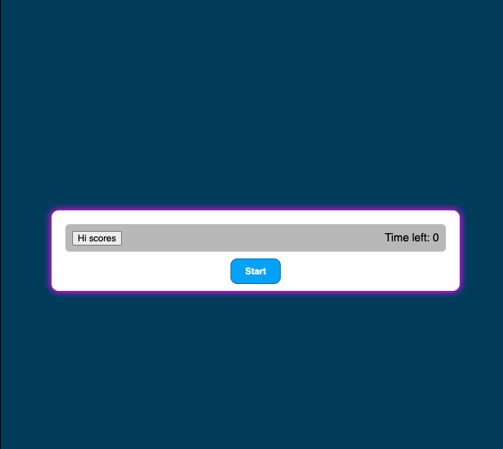
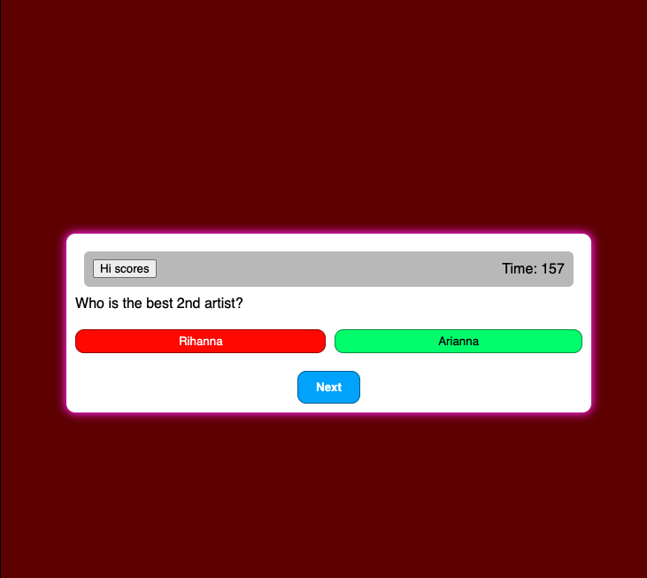

# Code-quiz

## _Description_

This app was meant as an intro to using element selectors and appending and also local storage basics.

### technologies used

- Javascript
- CSS
- HTML

# deployed application Link

https://omarvalsam.github.io/Code-quiz/

# Goals application end point

WHEN I click the start button

- THEN a timer starts and I am presented with a question

WHEN I answer a question

- THEN I am presented with another question

WHEN I answer a question incorrectly

- THEN time is subtracted from the clock

WHEN all questions are answered or the timer reaches 0

- THEN the game is over

WHEN the game is over

- THEN I can save my initials and score
